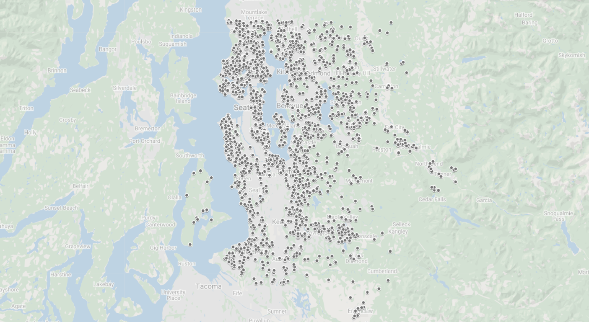

# Real Estate Analysis

## Summary
In this project for Flatiron School, Data Science Bootcamp, Drew, Andrew, and Andy explore King's County real estate data to determine the best correlation to sale price of houses, and reccomend the best course of action for home sellers to take when trying to increase the value of their home before selling. 

## Data
King's County real estate data includes over 21 thousand home sales. We reduced our focused attributes to squarefoot living, bedrooms, and condition (Good & Very Good). 

## Methods
This project uses a linear regression model with preprocessed data to infer the best option for homeowners to increase the value of their home before selling it. This allows for easy interpretation of which home features to renovate and the value these different features add.

## Results
Continuing with our goal of reasonable renovations to a home, we found that square foot living, bedrooms, a good and a very good condition were significant in explaining the variation in price.


We dropped bedrooms as it does not increase the price of a home. For every additional square foot of living space there is on average a $287 sale price increase. Increasing the condition of the home can raise the sale price on average anywhere between $36k to $115k.


## Conclusions
This analysis leads to following reccomendations and actions to take as a home seller:

- **Renovate an unfinished basement, garage or attic.** If you can find areas of your home that if finished add square feet of living space, this will significantly increase home value.
- **Through replacement of a few appliances and retexturing, improve condition.** Routine maintenance to overall keep the house in good shape as well as replacing some old/broken appliances, and as some small renovation like retexturing to improve the condition of your home can have a significant increase in home value.

## Next Steps
- **Specific small Scale remodeling** Determining specific increase in value that small scale remodeling can add. Specifics may include adding a hot tub or a new water heater.
- **Predictive modeling** Rather than our inferential model we can add a specific price estimate for features added.
- **Buying recommendations** Here we have provided information on increasing sale price on home. Now we would like to explore the best option on buying a new home.

## Links to Presentation and Sources
See the full analysis in the [Jupyter Notebook](./Real Estate Analysis.ipynb) or review the [presentation](./Real_Estate_Analysis.pdf)

## Repository Contents
```
├── code
│   ├── __init__.py
│   ├── project2_cleaning.py
│   ├── project2_viz.py
├── data
├── Images
├── README.md
├── Animal_Shelter_Needs_Presentation.pdf
└── animal_shelter_needs_analysis.ipynb
```
